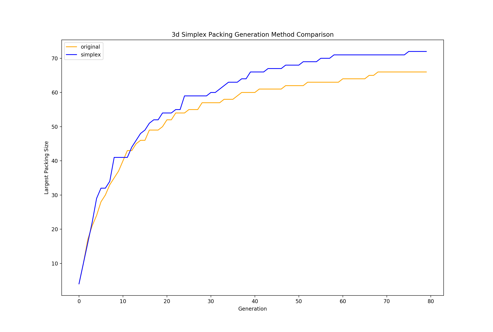

# PhD - Using Anchor Clustering to Analyse Codon Bias in the Human Genome 

<!-- ABOUT THE PROJECT -->
## About The Project

<!-- CHAPTER 2 -->
## Chapter 2 - Random Point Generation Problems

(<a href="#top">back to top</a>)

<!-- CHAPTER 3  -->
## Analysis of Codon Bias Utilizing Anchor Clustering 

<!-- GETTING STARTED -->
## Getting Started

This is an example of how you may give instructions on setting up your project locally.
To get a local copy up and running follow these simple example steps.

### Prerequisites

Requires Python 3.0+ 

(<a href="#top">back to top</a>)

<!-- USAGE EXAMPLES -->
## Usage

Use this space to show useful examples of how a project can be used. Additional screenshots, code examples and demos work well in this space. You may also link to more resources.

_For more examples, please refer to the [Documentation](https://example.com)_

(<a href="#top">back to top</a>)

<!-- LICENSE -->
## License

Distributed under the MIT License. See `LICENSE.txt` for more information.

(<a href="#top">back to top</a>)

<!-- CONTACT -->
## Contact

Matthew Stoodley - m.a.stoodley@gmail.com

(<a href="#top">back to top</a>)

<!-- ACKNOWLEDGMENTS -->
## Acknowledgments

Thank you to my advisors Dr. Steffen Graether and Dr. Ashlock

